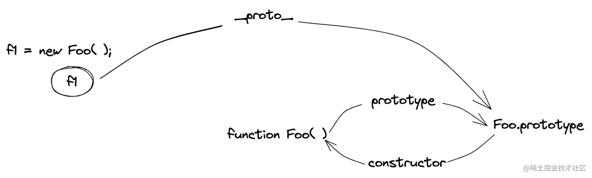

# 前端阁

## JavaScript

### 请解释事件代理 (event delegation)

事件代理是是一种在JavaScript编程模式，用来处理在HTML文档中创建、删除和更新元素时所带来的事件绑定问题。

在事件代理中，事件代理被绑定在一个父级元素上，而不是直接绑定在子元素上。当子元素触发点击事件时，事件会通过”事件冒泡机制“，
一级一级的往上冒泡，然后由父元素的事件来处理事件。

使用事件代理有以下几种好处：

1. 可以减少事件处理程序的数量，聪儿降低可维护性。

2. 在动态添加、删除元素时，无需多次添加事件，因为它们将继承父元素的事件处理程序。

3. 更容易为动态生成的元素绑定事件，因为它们不需要绑定单独的事件处理程序。

在实际实现中，可以通过使用事件对象的target属性来判断哪个子元素触发了事件，并根据需要对其进行相应的操作。

### unll 和 undefined的区别

- `null` 表示一个对象被定义，但是值为`空值`.。用法：
  - 作为函数的参数，表示该函数的出参数不是对象。
  - 作为对象的原型链的终点。
- `undefined`表示不存在这个值。就是此处应该有一个值，但是还没有被定义，当尝试读取时就会返回undefined。用法：
  - 函数没有返回值，默认是undefined。
  - 变量已声明，没有赋值。
  - 对象中没有赋值的属性。
  - 调用函数时，应该提供的参数没有提供。

### 如何判断JS数据类型？

- typeof

  `typeof`可以区分除了`Null`类型以外的其他基本数据类型，以及从对象类型中识别出函数（function）。

  其返回值有：`number`、`string`、`boolean`、`undefined`、`symbol`、`bigint`、`function`、`object`。

  其中, `typeof null`返回 `"object"`

  如果要识别`null`，可直接使用`===`全等运算符来判断。

  ```js
  typeof 1 // 'number'
  typeof '1' // 'string'
  typeof true // 'boolean'
  typeof undefined // 'undefined'
  typeof Symbol() // 'symbol'
  typeof null // 'object'
  typeof [] // 'object'
  typeof {} // 'object'
  typeof console // 'object'
  typeof console.log // 'function'
  ```

- instanceof

   `instanceof`一般是用来判断引用数据类型，但不能正确判断基本数据类型，根据在原型链中查找判断当前数据的原型对象是否存在返回布尔类型 

  ```js
  1 instanceof Number; // false
  true instanceof Boolean; // false
  'str' instanceof String; // false
  [] instanceof Array; // true
  function(){} instanceof Function; // true
  {} instanceof Object; // true
  let date = new Date();
  date instance of Date; // true
  ```

- Object.prototype.toString

  ```js
  Object.prototype.toString({}) // "[object Object]"
  Object.prototype.toString.call({}) // 同上结果，加上call也ok
  Object.prototype.toString.call(1) // "[object Number]"
  Object.prototype.toString.call('1') // "[object String]"
  Object.prototype.toString.call(true) // "[object Boolean]"
  Object.prototype.toString.call(function () {}) // "[object Function]"
  Object.prototype.toString.call(null) //"[object Null]"
  Object.prototype.toString.call(undefined) //"[object Undefined]"
  Object.prototype.toString.call(/123/g) //"[object RegExp]"
  Object.prototype.toString.call(new Date()) //"[object Date]"
  Object.prototype.toString.call([]) //"[object Array]"
  Object.prototype.toString.call(document) //"[object HTMLDocument]"
  Object.prototype.toString.call(window) //"[object Window]"
  ```

- Array.isArray

   `Array.isArray(value)`可以判断 value 是否为数组 

  ```js
  Array.isArray([]); // true
  Array.isArray({}); // false
  Array.isArray(1); // false
  Array.isArray('string'); // false
  Array.isArray(true); // false
  ```

### == 和 === 的区别

- `==`：两个等号称为等值符，当等号两边的值为相同类型时比较值是否相同，类型不同时会发生类型的自动转换，转换为相同的类型后再做比较。
- `===`：三个等号称为等同符，当等号两边的值为相同类型时，直接比较等号两边的值，值相同则返回 true；若等号两边值的类型不同时直接返回 false。也就是三个等号既要判断类型也要判断值是否相等。

### == 的对比过程

在 JavaScript 中，`==` 运算符进行相等比较时具有自动类型转换功能，比较的过程包含以下几个步骤：

1. 如果比较的两个值类型不同，就会尝试将它们转为相同的类型，优先把对象转为原始类型。
2. 如果其中一个值是 `null`，另一个值为 `undefined`，则两者相等。
3. 如果比较的两个值都是字符串、数字、布尔或 undefined，则比较它们的值是否相等；如果比较的两个值都为对象，则比较它们是否引用同一个对象。
4. 如果比较的两个值中有一个为 `NaN`，则它们不相等（注意，`NaN` 与任意值都不相等，包括它本身）。
5. 如果比较的两个值中至少有一个是布尔类型，则将它们转为数字再进行比较。
6. 如果比较的两个值类型为数字和字符串，则将字符串转为数字再进行比较。
7. 其他情况比较结果为 `false`。

例如：

```javascript
1 == "1"  // true，字符串 "1" 被自动转换成了数字 1
true == 1  // true，布尔值 true 被转换成了数字 1
null == undefined  // true
null == 0  // false，null 转换为 0，但它们不相等
NaN == NaN  // false，两个 NaN 值都不等于任何值，包括它们自己
"5" == 5  // true，字符串 "5" 被自动转换成了数字 5
"7" == 4  // false，字符串 "7" 无法转换为数字 4
```

注意，虽然 `==` 运算符在比较过程中具有自动类型转换的功能，但由于转换规则比较复杂，可能会产生不可预期的结果。因此，建议使用 `===` 运算符进行类型和值的全等比较。

### 如何遍历对象的属性

- 遍历自身**可枚举的属性（可枚举、非继承属性）**：`Object.keys()` 方法,该方法会返回一个由给定对象的自身可枚举属性组成的数组。
- 遍历自身的**所有属性（可枚举、不可枚举、非继承属性）**：`Object.getOwnPropertyNames()`方法，该方法会返回一个由指定对象的所有自身属性组成的数组
- 遍历**可枚举的自身属性和继承属性**：`for ... in ...`

### 什么是枚举

枚举（Enumeration）是一种数据类型，它用于表示一组有限的可能取值。在枚举中定义的每个取值成为枚举成员（Enum Member）。枚举成员通常用大写字母命名。

在 JavaScript 中，虽然没有内置的枚举类型，但我们可以使用常量对象（Constant Object）的方式来模拟枚举。常量对象是一种只读的对象，它的属性值在定义后不可修改。我们可以通过Object.freeze()方法使常量对象中的属性变为只读和不可配置，这样就可以防止常量对象的值被修改了。

例如，我们可以使用常量对象模拟一个星期几的枚举：

```javascript
const Weekdays = Object.freeze({
  MONDAY: 1,
  TUESDAY: 2,
  WEDNESDAY: 3,
  THURSDAY: 4,
  FRIDAY: 5,
  SATURDAY: 6,
  SUNDAY: 7
});
```

现在 `Weekdays` 对象就表示一个星期几的枚举，也就是只能取这七个值的一个。我们可以通过引用枚举成员来使用它：

```javascript
console.log(Weekdays.MONDAY);  // 1
console.log(Weekdays.SATURDAY); // 6
```

需要注意的是，虽然 JavaScript 中没有真正的枚举类型，但使用常量对象模拟枚举时，仍然需要保证枚举成员的唯一性和只读性，以保证枚举的正确性和安全性。

### 如何判断两个对象是否相等

- Object.is(obj1, obj2)`，判断两个对象都引用地址是否一致，true 则一致，false 不一致。

- 判断两个对象内容是否一致，思路是遍历对象的所有键名和键值是否都一致

  ① 判断两个对象是否指向同一内存
  ② 使用 `Object.getOwnPropertyNames` 获取对象所有键名数组
   ③ 判断两个对象的键名数组是否相等
   ④ 遍历键名，判断键值是否都相等

```javascript
function isObjValueEqual(a, b) {
  // 判断两个对象是否指向同一内存，指向同一内存返回 true
  if (a === b) return true;
  // 获取两个对象的键名数组
  let aProps = Object.getOwnPropertyNames(a);
  let bProps = Object.getOwnPropertyNames(b);
  // 判断两键名数组长度是否一致，不一致返回 false
  if (aProps.length !== bProps.length) return false;
  // 遍历对象的键值
  for (let prop in a) {
    // 判断 a 的键名，在 b 中是否存在，不存在，直接返回 false
    if (b.hasOwnProperty(prop)) {
      // 判断 a 的键值是否为对象，是对象的话需要递归；
      // 不是对象，直接判断键值是否相等，不相等则返回 false
      if (typeof a[prop] === 'object') {
        if (!isObjValueEqual(a[prop], b[prop])) return false;
      } else if (a[prop] !== b[prop]){
        return false
      }
    } else {
      return false
    }
  }
  return true;
}

```

### 强制类型转换和隐式类型转换有哪些

- 强制：
   转换成字符串: toString()、String()
   转换成数字：Number()、parseInt()、parseFloat()
   转换成布尔类型：Boolean()
- 隐式：
   拼接字符串：let str = 1 + "";

### JS 中的作用域和作用域链？

`作用域`，即变量（变量作用域又称上下文）和函数生效（能被访问）的区域或集合。作用域决定了代码区块中变量和其他资源的可见性。一般可分为：`全局作用域`、`局部作用域（函数作用域）`、`块级作用域`。

- `全局作用域`：任何不在函数中或是大括号中声明的变量，都是在全局作用域下，全局作用域下声明的变量可以在程序的任意位置访问。
- `局部作用域`：也叫做`函数作用域`，如果一个变量是在函数内部声明的，它就在一个函数作用域下面。这些变量只能在函数内部访问，不能在函数以外去访问。
- `块级作用域`：凡是代码块就可以划分变量的作用域，这种作用域的规则就叫做块级作用域。

`作用域链`：当在 JS 中使用一个变量时，JS 引擎会尝试在当前作用域下寻找该变量，如果没找到，再到它的上层作用域寻找，以此类推，直至找到该变量或是查找至全局作用域，如果在全局作用域里仍然找不到该变量，它就会在全局范围内隐式声明该变量(非严格模式下)或是直接报错。

**js 采用的是静态作用域，所以函数的作用域在函数定义时就确定了**

推荐阅读：[JavaScript深入之词法作用域和动态作用域](https://link.juejin.cn?target=https%3A%2F%2Fgithub.com%2Fmqyqingfeng%2FBlog%2Fissues%2F3)

### JS的预解析

S 代码的执行是由浏览器中的 JS 解析器来执行的，JS 解析器执行 JS 代码时，分为两个过程：`预解析过程`和`代码执行过程`。预解析分为`变量预解析（变量提升）`和`函数预解析（函数提升）`；代码执行是指按顺序从上至下执行。

- `变量提升`：把变量的声明提升到当前作用域的最前面，只提升声明，不提升赋值；
- `函数提升`：把函数的声明提升到当前作用域的最前面，只提升声明，不提升调用；

**函数表达式的写法不存在函数提升**

**函数提升优先级高于变量提升，即函数提升在变量提升之上，且不会被同名变量声明时覆盖，但是会被同名变量赋值后覆盖**

### Array.from() 和 Array.of() 的使用及区别

`Array.from()`：将伪数组对象或可遍历对象转换为真数组。接受三个参数：input、map、context。input：待转换的伪数组对象或可遍历对象；map：类似于数组的 map 方法，用来对每个元素进行处理，将处理后的值放入返回的数组；context：绑定map中用到的 this。

`Array.of()`：将一系列值转换成数组，会创建一个包含所有传入参数的数组，而不管参数的数量与类型，解决了`new Array()`行为不统一的问题

作者：庸人自扰的庸人
链接：https://juejin.cn/post/7176644710847479869
来源：稀土掘金
著作权归作者所有。商业转载请联系作者获得授权，非商业转载请注明出处。

### 原型与原型链

JS 是面向对象的，每个实例对象都有一个`__proto__`属性，该属性指向它的`原型`对象。该实例的构造函数有一个原型属性`prototype`，与实例的`__proto__`属性指向同一个对象。同时，`原型`对象的`constructor` 指向构造函数本身。



当一个对象在查找一个属性时，自身没有就会根据`__proto__`属性向它的`原型`进行查找，如果还是没有，则向它的`原型`的`原型`继续查找，直至查到`Object.prototype.__proto__`也就是`null`，这样就形成了`原型链`。

推荐阅读：[轻松理解JS 原型原型链](https://juejin.cn/post/6844903989088092174)

### 闭包

在 JavaScript 中，每当创建一个函数，闭包就会在函数创建的同时被创建出来。可以在一个内层函数中访问到其外层函数的作用域。

闭包就是能够读取其他函数内部变量的函数。主要作用是解决变量污染问题，也可以用来延长局部变量的生命周期。

优点：延长局部变量的生命周期

缺点：会导致函数的变量一直保存在内存中，过多的闭包可能会导致内存泄漏

推荐阅读：[我从来不理解JavaScript闭包，直到有人这样向我解释它](https://juejin.cn/post/6844903858636849159)

### new 操作符的实现机制

1. 首先创建了一个新的`空对象`
2. `设置原型`，将对象的原型设置为函数的`prototype`对象。
3. 让函数的`this`指向这个对象，执行构造函数的代码（为这个新对象添加属性）
4. 判断函数的返回值类型，如果是值类型，返回创建的对象。如果是引用类型，就返回这个引用类型的对象。

```js
function myNew(context) {
  const obj = new Object();
  obj.__proto__ = context.prototype;
  const res = context.apply(obj, [...arguments].slice(1));
  return typeof res === "object" ? res : obj;
}
```

### this的理解

概念：
 `this`是 JS 的一个关键字，它是函数运行时，自动生成的一个内部对象，只能在函数内部使用，随着函数使用场合的不同，`this`的值会发生变化，但有一个总的原则：`this指的是调用函数的那个对象`。

this的指向：
 ① 作为普通函数执行时，`this`指向`window`，但在严格模式下`this`指向`undefined`。
 ② 函数作为对象里的方法被调用时，`this`指向该对象.
 ③ 当用`new`运算符调用构造函数时，`this`指向返回的这个对象。
 ④ 箭头函数的`this`绑定看的是`this`所在函数定义在哪个对象下，就绑定哪个对象。如果存在嵌套，则`this`绑定到最近的一层对象上。
 ⑤ `call()`、`apply()`、`bind()`是函数的三个方法，都可以显式的指定调用函数的`this`指向。

### call、apply、bind的区别以及手写实现

- `call()`可以传递两个参数，第一个参数是指定函数内部中`this`的指向，第二个参数是函数调用时需要传递的参数。改变`this`指向后原函数会立即执行，且此方法只是临时改变`this`指向一次。

```javascript
// 实现call方法
Function.prototype.myCall = function (context) {
  // 判断调用对象
  if (typeof this != "function") {
    throw new Error("type error");
  }
  // 首先获取参数
  let args = [...arguments].slice(1);
  let res = null;
  // 判断context是否传入，如果没有，就设置为window
  context = context || window;
  // 将被调用的方法置入context的属性
  // this 即为要调用的方法
  context.fn = this;
  // 执行要被调用的方法
  res = context.fn(...args);
  // 删除手动增加的属性方法
  delete context.fn;
  // 执行结果返回
  return res;
}
```

- `apply()`接受两个参数，第一个参数是`this`的指向，第二个参数是函数接受的参数，以`数组`的形式传入。改变`this`指向后原函数会立即执行，且此方法只是临时改变`this`指向一次。

```javascript
// 实现apply方法
Function.prototype.myApply = function(context) {
  if (typeof this != "function") {
    throw new Error("type error");
  }
  let res = null;
  context = context || window;
  // 使用 symbol 来保证属性唯一
  // 也就是保证不会重写用户自己原来定义在context中的同名属性
  const fnSymbol = Symbol();
  context[fnSymbol] = this;
  // 执行被调用的方法
  if (arguments[1]) {
    res = context[fnSymbol](...arguments[1]);
  } else {
    res = context[fnSymbol]();
  }
  delete context[fnSymbol];
  return res;
}
```

- `bind()`方法的第一参数也是`this`的指向，后面传入的也是一个参数列表(但是这个参数列表可以分多次传入)。改变`this`指向后不会立即执行，而是返回一个永久改变`this`指向的函数。

```javascript
// 实现bind方法
Function.prototype.myBind = function (context) {
  if (typeof this != "function") {
    throw new Error("type error");
  }
  let args = [...arguments].slice(1);
  const fn = this;
  return function Fn() {
    return fn.apply(
      this instanceof Fn ? this : context,
      // 当前这个 arguments 是指 Fn 的参数
      args.concat(...arguments)
    );
  };
}
```

------

共同点：改变函数执行时的上下文，简而言之就是改变函数运行时的`this`指向。
 不同：

- `call()`和`bind()`第二个参数是列表形式的；`apply()`第二个参数是数组形式。
- `call()`和`apply()`是立即执行；`bind()`不会立即执行而是生成一个修改`this`之后的新函数。

### 箭头函数

箭头函数是定义函数一种新的方式，比普通函数定义更加方便和简单。

箭头函数不绑定`this`，会捕获其所在上下文的`this`，作为自己的`this`。

箭头函数不能用作构造函数，也就是说不可以使用`new`命令，否则会抛出错误。

箭头函数不绑定`arguments`，取而代之用`rest`参数解决，同时没有`super`和`new.target`。

使用`call`，`apply`，`bind`并不会改变箭头函数中的`this`指向。对箭头函数使用`call`或`apply`方法时，只会传入参数并调用函数；对箭头函数使用`bind`方法时，只会返回一个预设参数的新函数，并不会改变这个新函数的`this`指向。

### 浅拷贝和深拷贝的实现

 `浅拷贝`：如果属性是基本类型，拷贝的就是基本类型的值；如果属性是引用类型，拷贝的就是内存地址。即浅拷贝是`拷贝一层`，深层次的引用类型则共享内存地址。常用的方法有：object.assign，扩展运算符等等 

```js
var a = { count: 1, deep: { count: 2 } };
var b = Object.assign({}, a);
// 或者
var c = {...a};

// 实现一个浅拷贝
function shallowClone(obj) {
  const newObj = {};
  for (let prop in obj) {
    if (obj.hasOwnProperty(prop)) {
      newObj[prop] = obj[prop];
    }
  }
  return newObj
}
```

`深拷贝`：开辟一个新的栈，两个对象的属性完全相同，但是对应两个不同的地址，修改一个对象的属性，不会改变另一个对象的属性。

```js
/**
 * 深拷贝
 * @param {Object} obj 要拷贝的对象
 * @param {Map} map 用于存储循环引用对象的地址
 */

function deepClone(obj = {}, map = new Map()) {
  if (obj === null) return obj // 如果是null或者undefined我就不进行拷贝操作
  if (obj instanceof Date) return new Date(obj)
  if (obj instanceof RegExp) return new RegExp(obj)
  // 可能是对象或者普通的值  如果是函数的话是不需要深拷贝
  if (typeof obj !== 'object') return obj
  if (map.get(obj)) {
    return map.get(obj);
  }
  let result = {}; // 初始化返回结果
  if (
    obj instanceof Array ||
    // 加 || 的原因是为了防止 Array 的 prototype 被重写，Array.isArray 也是如此
    Object.prototype.toString(obj) === "[object Array]"
  ) {
    result = [];
  }
  // 防止循环引用
  map.set(obj, result);
  for (const key in obj) {
    // 保证 key 不是原型属性
    if (obj.hasOwnProperty(key)) {
      // 递归调用
      result[key] = deepClone(obj[key], map);
    }
  }
  return result;
}
```

### JavaScript中内存泄露的几种情况

`内存泄漏`一般是指系统进程不再用到的内存，没有及时释放，造成内存资源浪费，导致程序运行速度减慢甚至系统崩溃等严重后果。

造成内存泄漏的原因有：

1. `全局变量。`在局部作用域中，函数执行完毕后，变量就没有存在的必要了，垃圾回收机制很快的做出判断并回收；但是对于全局变量，很难判断什么时候不用这些变量，无法正常回收。
    解决办法：
    ① 尽量少使用全局变量；
    ② 使用严格模式，在 js 文件头部或者函数的顶部加上`use strict`。
2. `闭包引起的内存泄露。`闭包可以读取函数内部的变量，然后让这些变量始终保存在内存中，如果在使用结束后没有将局部变量清除，就可能导致内存泄露。
    解决办法：将事件处理函数定义在外部，解除闭包。
3. `被遗忘的定时器。`定时器`setInterval`或者`setTimeout`不再需要使用时，且没有被清除，导致定时器的回调函数及其内部依赖的变量都不能被回收，就会造成内存泄漏。
    解决办法：当不需要定时器的时候，调用`clearInterval`或者`clearTimeout`手动清除。
4. `事件监听。`垃圾回收机制不好判断事件是否需要被解除，导致`callback`不能被释放，此时需要手动解除绑定。
    解决办法：及时使用`removeEventListener`移除事件监听。
5. `元素引用没有清理。`
    解决办法：移除元素后，手动设置元素的引用为`null`。
6. `console`。传递给`console.log`的对象是不能被垃圾回收，可能会存在内存泄漏。
    解决办法：清除不必要的`console`。

### 防抖和节流的区别，以及手写实现

`防抖`：多次触发事件，事件处理函数只执行一次，并且是在触发操作结束时执行。也就是说，当一个事件被触发，准备执行事件函数前，会等待一定的时间，在这个等待时间内，如果没有再次被触发，那么就执行，如果又触发了，那就本次作废，重置等待时间，直到最终能执行。
 主要应用场景：搜索框搜索输入，用户最后一次输入完，再发送请求；手机号、邮箱验证输入检测

`节流`：事件触发后，规定时间内，事件处理函数不能再次被调用。也就是说在规定的时间内，函数只能被调用一次，且是最先被触发调用的那次。
 主要应用场景：高频点击、表单重复提交等。

``` js
/*** 防抖函数 n 秒后再执行该事件，若在 n 秒内被重复触发，则重新计时
   * @param func 要被防抖的函数
   * @param wait 规定的时间
   */
function debounce(func, wait) {
  let timeout;
  return function () {
    let context = this; // 保存this指向
    let args = arguments; // 拿到event对象

    clearTimeout(timeout);
    timeout = setTimeout(function () {
      func.apply(context, args)
    }, wait)
  }
}
/*** 节流函数 n 秒内只运行一次，若在 n 秒内重复触发，只有一次生效
   * @param fn 要被节流的函数
   * @param wait 规定的时间
   */
function throttled(fn, wait) {
  let timer = null;
  return function (...args) {
    if (!timer) {
      timer = setTimeout(() => {
        fn.apply(this, args);
        timer = null;
      }, wait);
    }
  }
}
```


### EventLoop事件循环

js 是单线程运行的，当遇到一个异步事件后并不会一直等待其返回结果，而是会将这个事件挂起，继续执行执行栈中的其他任务。当一个异步事件返回结果后，js会将这个事件加入与当前执行栈不同的另一个队列--`事件队列（Task Queue）`。被放入事件队列不会立刻执行其回调，而是等待当前执行栈中的所有任务都执行完毕， 主线程处于闲置状态时，主线程会去查找事件队列是否有任务。如果有，那么主线程会从中取出排在第一位的事件，并把这个事件对应的回调放入执行栈中，然后执行其中的同步代码...，如此反复，这样就形成了一个无限的循环，这个过程被称为`事件循环（Event Loop）`。

实际上,异步任务之间并不相同，它们的执行优先级也有区别。异步任务分两类：`微任务（micro task`）和`宏任务（macro task）`。

微任务包括： `promise 的回调`、node 中的 `process.nextTick` 、对 Dom 变化监听的 `MutationObserver`。

宏任务包括： script 脚本的执行，`setTimeout` 、`setInterval` 和`setImmediate` 一类的定时事件，还有如 I/O 操作，UI 渲染等。

在一个事件循环中，异步事件返回结果后会被放到一个事件队列中。然而，根据这个异步事件的类型，这个事件实际上会被对应的`宏任务队列`或者`微任务队列`中去。并且在当前执行栈为空的时候，主线程会查看微任务队列是否有事件存在。如果不存在，那么再去宏任务队列中取出一个事件并把对应的回调加入当前执行栈；如果存在，则会依次执行队列中事件对应的回调，直到微任务队列为空，然后去宏任务队列中取出最前面的一个事件，把对应的回调加入当前执行栈...如此反复，进入循环。

**在当前执行栈执行完毕时会立刻先处理所有微任务队列中的事件，然后再去宏任务队列中取出一个事件。同一次事件循环中，微任务永远在宏任务之前执行**。

 推荐阅读：
[详解JavaScript中的Event Loop（事件循环）机制](https://link.juejin.cn/?target=https%3A%2F%2Fzhuanlan.zhihu.com%2Fp%2F33058983)
[微任务、宏任务与Event-Loop](https://juejin.cn/post/6844903657264136200) 

### Promise

`Promise`异步编程的一种解决方案。`Promise`是一个构造函数，接收一个函数作为参数，返回一个 Promise 实例。一个 Promise 实例有三种状态，分别是`pending`、`fulfilled`和`rejected`，分别代表了进行中、已成功和已失败。实例的状态只能由 pending 转变 fulfilled 或者 rejected 状态，并且状态一经改变，就无法再改变了。状态的改变是通过`resolve()`和`reject()`函数来实现的，可以在异步操作结束后调用这两个函数改变 Promise 实例的状态。Promise 的原型上定义了一个 `then`方法，使用这个 then 方法可以为两个状态的改变注册回调函数。这个回调函数属于微任务，会在本轮事件循环的末尾执行。